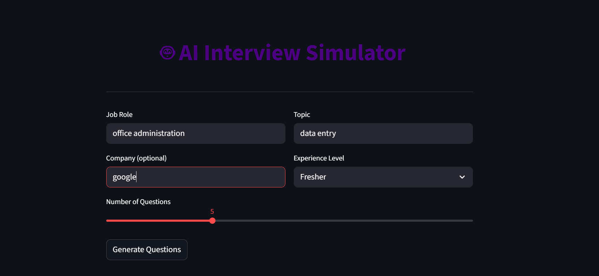
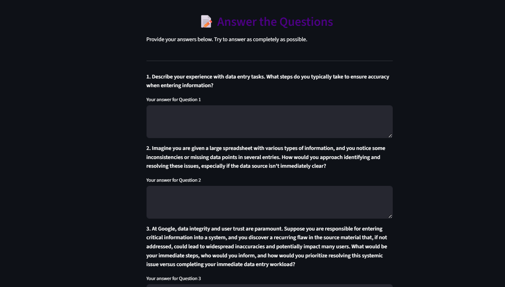
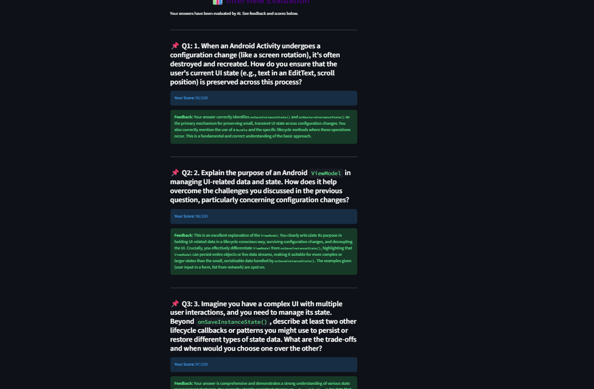
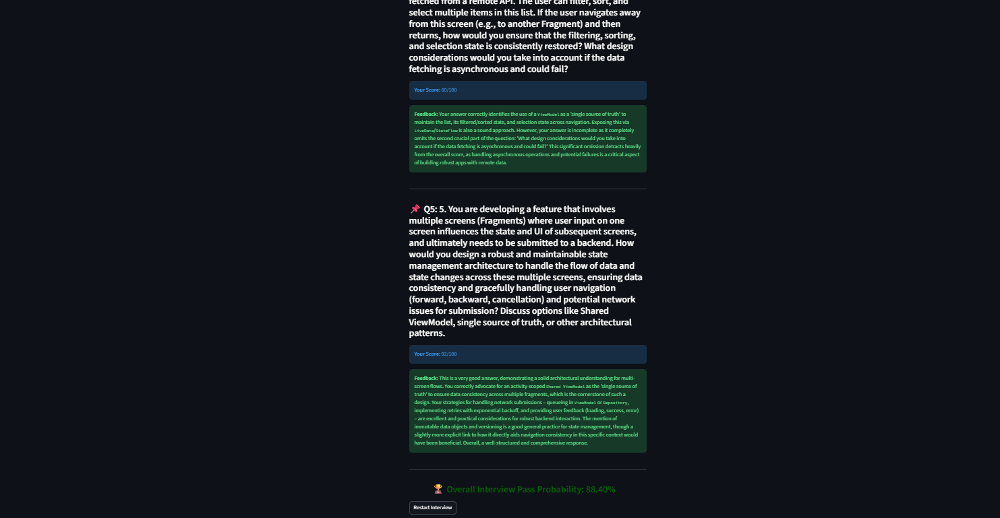
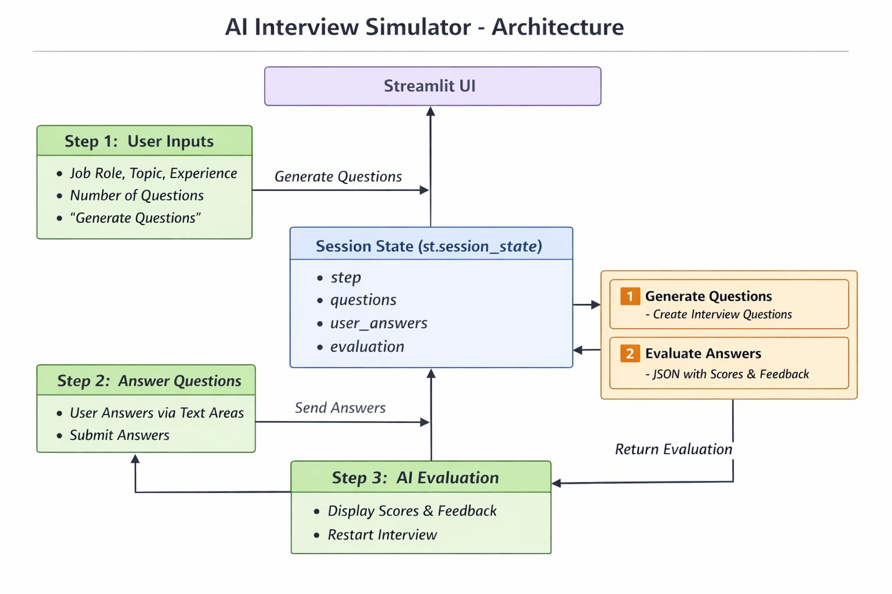
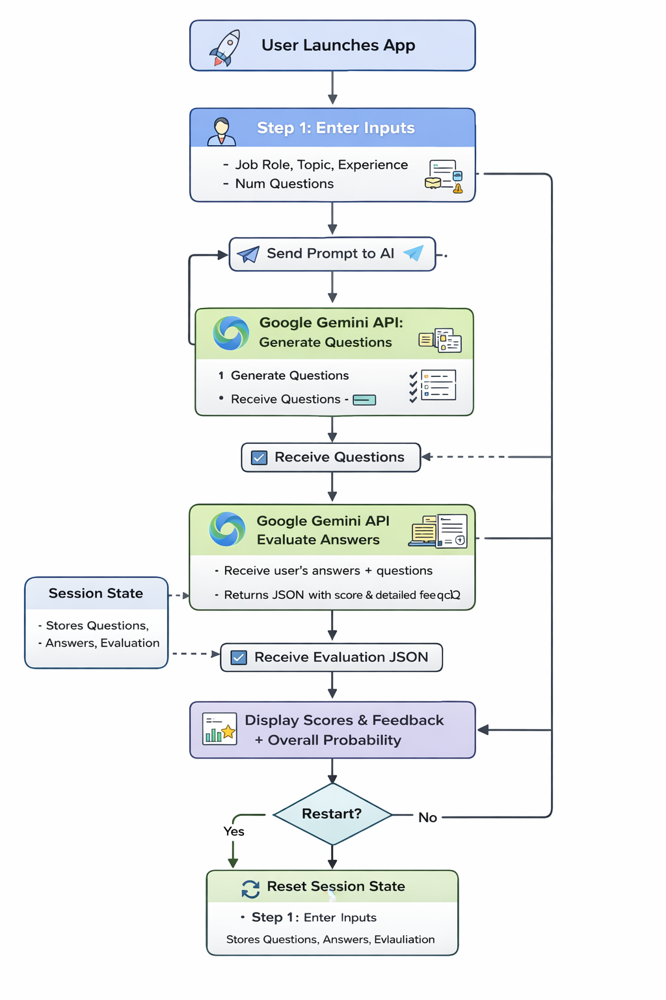

<p align="center">
  
</p>

# [Ai Interview Simulator] 🎯

## Basic Details

### Team Members
- Member 1: [Nile Varghese] - [GEC Thrissur]

### Hosted Project Link
[mention your project hosted link here]

### Project Description
[An interactive AI-powered interview simulator that generates role- and topic-specific questions, allows users to answer them, and evaluates responses to provide an overall probability of passing the interview.]

### The Problem statement
[Many job seekers struggle to practice interviews effectively and receive objective feedback. Existing solutions either provide generic questions or no scoring, leaving users unsure of their strengths and weaknesses.]

### The Solution
[This project generates tailored interview questions, collects user answers, evaluates them using an AI evaluator (Gemini API), and calculates an overall pass probability. The simulator adapts question difficulty based on the number of questions and user experience level.]

---

## Technical Details

### Technologies/Components Used

**For Software:**
- Languages used: [python]
- Frameworks used: [streamlit]
- Libraries used: [google-genai, json, streamlit]
- Tools used: [VS Code, Git]


## Features

List the key features of your project:
- Feature 1: [Dynamic Question Generation: Generates questions specific to job role, topic, experience, and company.]
- Feature 2: [Adaptive Difficulty: Difficulty increases as questions progress.]
- Feature 3: [Interactive Answer Submission: Users input answers in a clean interface.]
- Feature 4: [Pass Probability Calculation: Aggregates scores to give an overall probability of passing]

---

## Implementation

### For Software:

#### Installation
```bash
   # Create virtual environment
   python -m venv venv
   # Activate environment (Windows)
   venv\Scripts\activate
   # Activate environment (Linux/Mac)
   source venv/bin/activate

# Install dependencies
pip install streamlit google-genai
```
#### Run
```bash
   streamlit run app.py
```


## Project Documentation

### For Software:

#### Screenshots (Add at least 3)

 
](Add screenshot 1 here with proper name)
user enter the details

 
(Add screenshot 2 here with proper name)
it gives us the question

 
  
(Add screenshot 3 here with proper name)
it shows how ai analysed tha answers and give the probability of passing

#### Diagrams

**System Architecture:**


Flow Summary: 


Step 1: Input & Question Generation

User provides role, topic, experience.

st.session_state initialized.

Streamlit sends a prompt to Gemini API → gets generated questions → stores in session_state.questions.

Step 2: User Answers

Questions displayed via Streamlit text_area.

User answers stored in st.session_state.user_answers.

Step 3: AI Evaluation

Streamlit constructs evaluation prompt with questions + user answers.

Gemini API returns JSON with score & feedback → stored in session_state.evaluation.

UI displays results & overall pass probability.

State Management

st.session_state ensures continuity across steps.

Restart button resets the session for a fresh interview.


**Application Workflow:**

![Workflow] 
workflow.png)
User Launches App

Streamlit UI loads.

Session state is initialized (step=1, empty questions/answers/evaluation).

Step 1: User Inputs

User enters: Job Role, Company, Topic, Experience, and Number of Questions.

Clicks “Generate Questions” → sends prompt to Gemini API.

AI Generates Questions

Gemini API returns numbered questions.

Questions stored in st.session_state.questions.

Session step updated to 2 (step=2).

Step 2: Answer Questions

UI displays questions with text areas.

User types answers → stored in st.session_state.user_answers.

Clicks “Submit Answers” → step updated to 3 (step=3).

Step 3: AI Evaluation

Streamlit constructs evaluation prompt including questions + answers.

Gemini API returns JSON evaluation with:

Score per question (0–100)

Detailed feedback

Stored in st.session_state.evaluation.

Display Results

UI shows:

Individual scores and feedback

Overall pass probability

User can click “Restart Interview” → resets session state (step=1) to start over.

Session State Management

Maintains continuity across steps.

Ensures user can navigate back/forward without losing data.

---


#### Build Photos

 


---

## Additional Documentation

### For Web Projects with Backend:

#### API Documentation

**Base URL:** `https://api.yourproject.com`

##### Endpoints

**GET /api/endpoint**
- **Description:** [What it does]
- **Parameters:**
  - `param1` (string): [Description]
  - `param2` (integer): [Description]
- **Response:**
```json
{
  "status": "success",
  "data": {}
}
```

**POST /api/endpoint**
- **Description:** [What it does]
- **Request Body:**
```json
{
  "field1": "value1",
  "field2": "value2"
}
```
- **Response:**
```json
{
  "status": "success",
  "message": "Operation completed"
}
```

[Add more endpoints as needed...]

---

### For Mobile Apps:

#### App Flow Diagram


*Explain the user flow through your application*

#### Installation Guide

**For Android (APK):**
1. Download the APK from [Release Link]
2. Enable "Install from Unknown Sources" in your device settings:
   - Go to Settings > Security
   - Enable "Unknown Sources"
3. Open the downloaded APK file
4. Follow the installation prompts
5. Open the app and enjoy!

**For iOS (IPA) - TestFlight:**
1. Download TestFlight from the App Store
2. Open this TestFlight link: [Your TestFlight Link]
3. Click "Install" or "Accept"
4. Wait for the app to install
5. Open the app from your home screen

**Building from Source:**
```bash
# For Android
flutter build apk
# or
./gradlew assembleDebug

# For iOS
flutter build ios
# or
xcodebuild -workspace App.xcworkspace -scheme App -configuration Debug
```

---


### For Scripts/CLI Tools:

#### Command Reference

**Basic Usage:**
```bash
python script.py [options] [arguments]
```

**Available Commands:**
- `command1 [args]` - Description of what command1 does
- `command2 [args]` - Description of what command2 does
- `command3 [args]` - Description of what command3 does

**Options:**
- `-h, --help` - Show help message and exit
- `-v, --verbose` - Enable verbose output
- `-o, --output FILE` - Specify output file path
- `-c, --config FILE` - Specify configuration file
- `--version` - Show version information

**Examples:**

```bash
# Example 1: Basic usage
python script.py input.txt

# Example 2: With verbose output
python script.py -v input.txt

# Example 3: Specify output file
python script.py -o output.txt input.txt

# Example 4: Using configuration
python script.py -c config.json --verbose input.txt
```

#### Demo Output

**Example 1: Basic Processing**

**Input:**
```
This is a sample input file
with multiple lines of text
for demonstration purposes
```

**Command:**
```bash
python script.py sample.txt
```

**Output:**
```
Processing: sample.txt
Lines processed: 3
Characters counted: 86
Status: Success
Output saved to: output.txt
```

**Example 2: Advanced Usage**

**Input:**
```json
{
  "name": "test",
  "value": 123
}
```

**Command:**
```bash
python script.py -v --format json data.json
```

**Output:**
```
[VERBOSE] Loading configuration...
[VERBOSE] Parsing JSON input...
[VERBOSE] Processing data...
{
  "status": "success",
  "processed": true,
  "result": {
    "name": "test",
    "value": 123,
    "timestamp": "2024-02-07T10:30:00"
  }
}
[VERBOSE] Operation completed in 0.23s
```

---

## Project Demo

### Video
[Add your demo video link here - YouTube, Google Drive, etc.]

*Explain what the video demonstrates - key features, user flow, technical highlights*

### Additional Demos
[Add any extra demo materials/links - Live site, APK download, online demo, etc.]

---

## AI Tools Used (Optional - For Transparency Bonus)

If you used AI tools during development, document them here for transparency:

**Tool Used:** [Google Gemini API,chatgpt]

**Purpose:** [What you used it for]
- Generate role- and topic-specific interview questions
- Evaluate user answers and provide professional feedback
- Calculate pass probability
- 
**Key Prompts Used:**
- Generate adaptive interview questions
- Honest evaluation without sugarcoating
- Feedback with scoring per question

**Percentage of AI-generated code:** [20-25%]

**Human Contributions:**

App architecture and UI design
Streamlit integration and multi-step interface
Scoring aggregation and result display logic
Project documentation

*Note: Proper documentation of AI usage demonstrates transparency and earns bonus points in evaluation!*

---

## Team Contributions

- [Nile Varghese]: [Project architecture, AI integration, Streamlit UI, evaluation logic, documentation]


---

## License

This project is licensed under the [LICENSE_NAME] License - see the [LICENSE](LICENSE) file for details.

**Common License Options:**
- MIT License (Permissive, widely used)
- Apache 2.0 (Permissive with patent grant)
- GPL v3 (Copyleft, requires derivative works to be open source)

---

Made with ❤️ at TinkerHub
